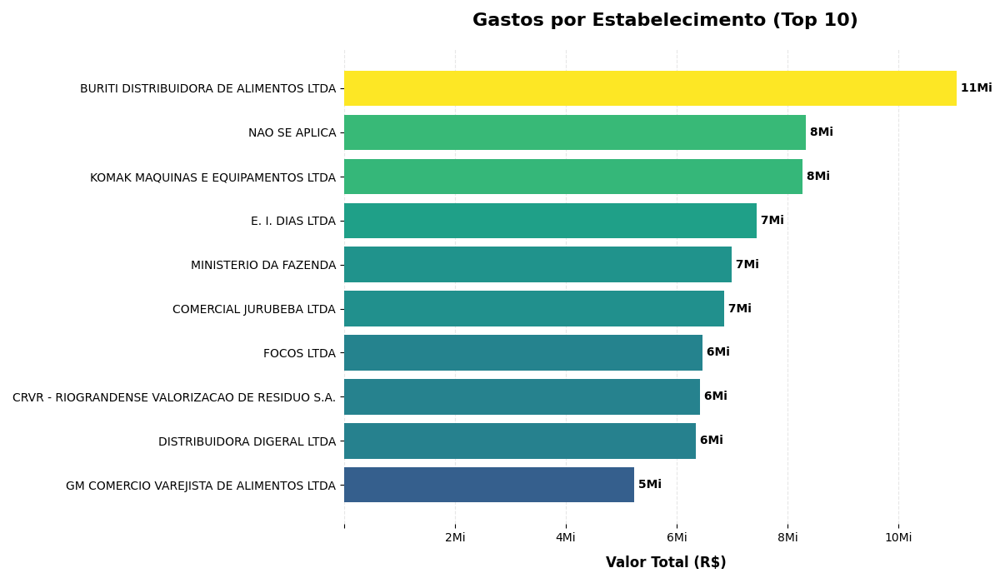
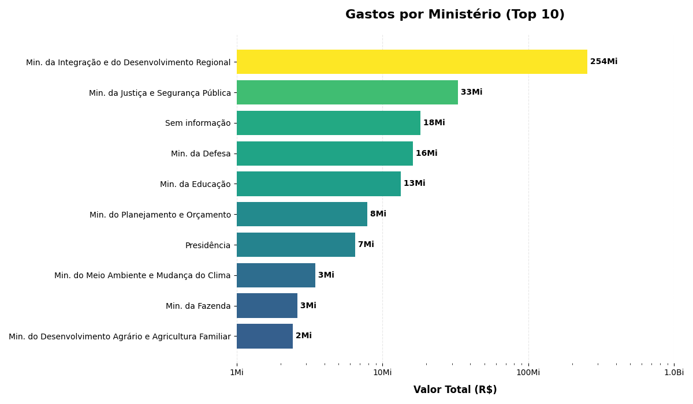
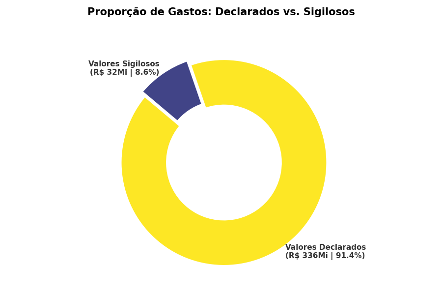
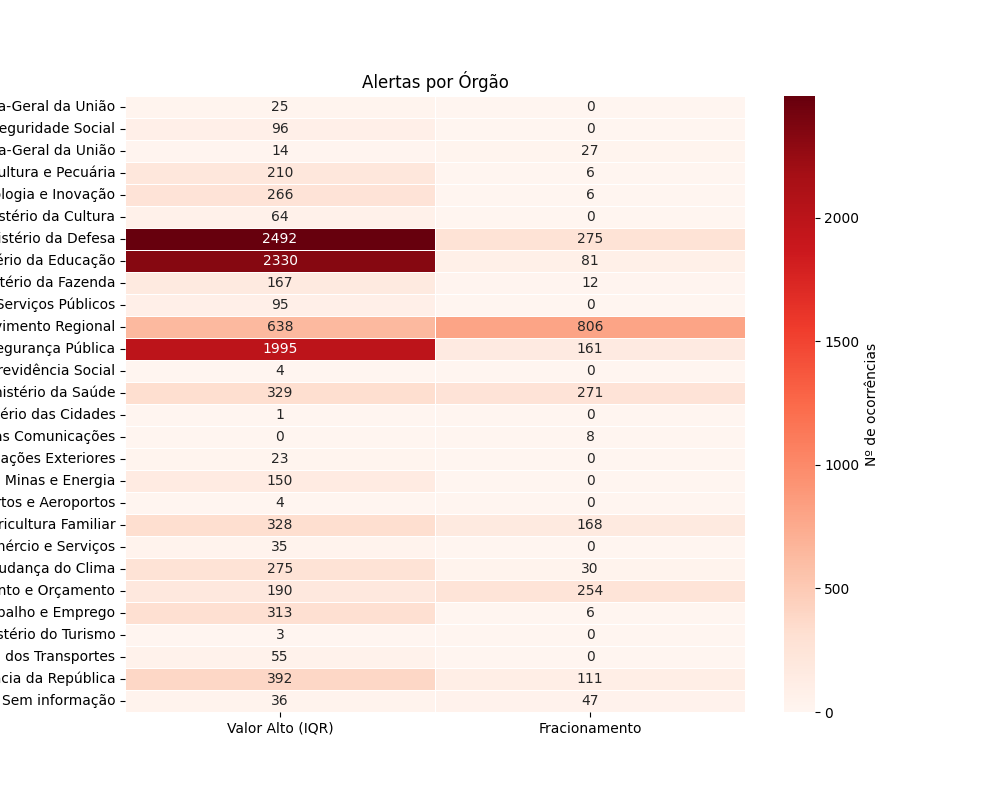
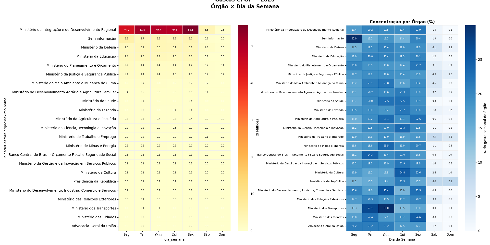
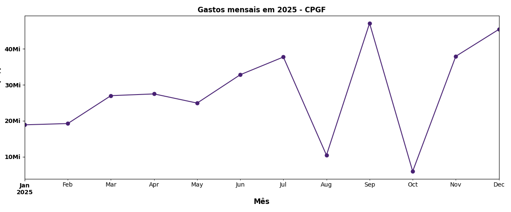

# 💳 Análise do Cartão de Pagamento do Governo Federal (CPGF)

Projeto de extração, limpeza e análise de dados públicos sobre gastos realizados com o **Cartão de Pagamento do Governo Federal**, utilizando a [API do Portal da Transparência](https://portaldatransparencia.gov.br/api-de-dados).

---

## 📌 Sobre o Projeto

O CPGF é um instrumento utilizado por servidores públicos federais para pagamento de despesas do governo. Este projeto automatiza a coleta desses dados via API pública e realiza análises exploratórias para identificar padrões de gastos, maiores beneficiários e **movimentações financeiras suspeitas**.

---

## 🗂️ Estrutura do Projeto

```
📁 Projeto---CPGF/
├── extr_data.py              # Extração de dados via API do Portal da Transparência
├── primeira_analise.ipynb    # Limpeza, análise exploratória 
├── analise.anomalia.ipynb    # Busca de possiveis movimentações suspeitas (Transações Outliers)
├── sazonalidade.ipynb        # Encontra alguma sazonalidade nos gastos presentes
├── Clustering.ipynb          # Utilizado K-Mean para agrupar transações por caracteristicas
├── dados_2025.csv    # Exemplo de dados extraídos (O Dataset foi alterado para censurar o nome dos portadores)
└── README.md
```

---

## ⚙️ Funcionalidades

### `extr_data.py` — Extração de Dados
- Realiza requisições paginadas à API do Portal da Transparência
- Suporte a filtros por período (`mesExtratoInicio` / `mesExtratoFim`)
- Exporta os dados consolidados em `.csv`

### `primeira_analise.ipynb` — Análise e Visualização de dados
- **Limpeza de dados**: normalização de valores monetários e datas
- **Remoção de duplicatas**
- **Resumo estatístico**: total de transações, valor total, média, máximo e mínimo
- **Rankings**: estabelecimentos, órgãos e portadores com maiores gastos
- **Geração de Gráficos** Foram Gerados gráficos indicando os estabelecimentos e Orgãos que me foram beneficados, além de uma análise de movimentação sigilosa

### `analise_anomalia.ipynb` - Detecção de Anomálias
- **Fracionamento de Transação**: Identifica transações repetidas diversas vezes em um único dia
- **Identificação de Outliers**: Utilizando a amplitude Interquartílica (AIQ), é detectados transações que fogem do padrão (Outliers)
- **Ranking**: É realizado a soma dos métodos utilizados (Fracionamento+Outliers) para gerar um ranking com as transações anormais

### `Sazonalidade.ipynb`- Detecção de Padrões datados


---

## 🚀 Como Usar

### 1. Pré-requisitos

```bash
pip install pandas numpy matplotlib sklearn requests 
```

### 2. Obter chave da API

Acesse o [Portal da Transparência](https://portaldatransparencia.gov.br/api-de-dados/cadastrar-email) e cadastre seu e-mail para obter uma chave de API gratuita.

### 3. Extrair os dados

Edite as variáveis no `extr_data.py`:

```python
headers = {
    "chave-api-dados": "SUA_CHAVE_AQUI" #Insira sua chave 
}

param = {
    "pagina": 1,
    "mesExtratoInicio": "01/2025",
    "mesExtratoFim": "01/2025"
}
```

Execute:

```bash
python extr_data.py
```

---

## 📊 Resultados

```

Numero de Transações: 143361

Valor Total gasto: R$ 36,76 Milhões

Valor médio por transação: R$ 2563,95

Maior Transação: R$ 8,27 Milhões

Maior Estorno: R$ 4,34 Milhões

Estabelecimento que mais recebeu: 
BURITI DISTRIBUIDORA DE ALIMENTOS LTDA:    R$ 11,05 Milhões

Órgão que mais gastou: 
Min. da Integração e Desenvolvimento Regional    R$ 254,19 Milhões
```
---

## Resultados Gráficos


---

---


---
## 🔍 Análise de Anomálias

| Técnica | Descrição |
|---|---|
| **IQR (*Interquartile Range*)** | Determina o intervalo entre o terceiro e primeiro quartil, indicando o quão disperso estão os dados centrais |
| **Fracionamento** | Detecta mais de 3 transações do mesmo portador no mesmo estabelecimento no mesmo dia |


📊 Resultados

```
valorTransacao | dataTransacao |              estabelecimento.nome |  unidadeGestora.orgaoMaximo.nome
1699.95          2025-06-17     R G S COMERCIO E SERVICOS LTDA       Ministério da Defesa       
150423.02        2025-12-19                 MK CONSTRUCAO LTDA       Ministério da Integração e do Desenvolvimento...
3558.54          2025-03-21                     SEM INFORMACAO       Ministério da Ciência, Tecnologia e Inovação 
2808.00          2025-11-27  ENCANTO DO VALE DESCARTAVEIS LTDA       Ministério da Ciência, Tecnologia e Inovação    
2845.70          2025-11-27  ENCANTO DO VALE DESCARTAVEIS LTDA       Ministério da Ciência, Tecnologia e Inovação    
2856.00          2025-11-27  ENCANTO DO VALE DESCARTAVEIS LTDA       Ministério da Ciência, Tecnologia e Inovação    
2859.40          2025-11-27  ENCANTO DO VALE DESCARTAVEIS LTDA       Ministério da Ciência, Tecnologia e Inovação    
2836.18          2025-11-27  ENCANTO DO VALE DESCARTAVEIS LTDA       Ministério da Ciência, Tecnologia e Inovação    
1468.95          2025-11-27  ENCANTO DO VALE DESCARTAVEIS LTDA       Ministério da Ciência, Tecnologia e Inovação    
2430.00          2025-03-27             JHONATAN DEMARCO ROCHA       Ministério do Planejamento e Orçamento           
                            
```
---
# Resultados Gráficos


---
**Vale Ressaltar: Esse é um estudo com objetivo único e exclusivamente didático, as 'anomálias' levam em consideração *outliers* e fracionamento mas nada que realmente indique que seja uma transação suspeita, na vida real muitos fatores podem levar a esse tipo de transação. A idéia é indicar no estudo um sistema que pode facilitar possíveis auditorias** 

---
## 🗓️ Análise de Sazonalidade

| Técnica | Descrição |
|---|---|
| **Mês** | Foi realizado a separação e agrupamento por mês |
| **Semanas** | Agrupamento por dias da semana |

# Resultados Gráficos





## 📋 Dados Utilizados

Os dados são públicos e provenientes do [Portal da Transparência do Governo Federal](https://portaldatransparencia.gov.br/), com base no endpoint `/api-de-dados/cartoes`.

Cada registro contém informações como:
- Data e valor da transação
- Estabelecimento (CNPJ, nome, razão social)
- Unidade gestora e órgão máximo
- Portador do cartão (CPF, nome)

---

## 📄 Licença

Este projeto é de uso livre para fins educacionais e de transparência pública.

---

## 🙋 Autor

**João Alisson** — [github.com/JoaoQAlisson](https://github.com/JoaoQAlisson)
